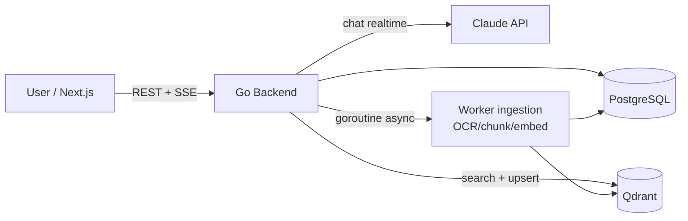

# 02 — Tech Stack & Arsitektur

## 1. Stack

| Layer | Pilihan | Versi target | Catatan |
|-------|---------|--------------|---------|
| Frontend | **Next.js** (React) | **16.2** (App Router) | **Dari client** (folder `frontend/`). React 19, Tailwind v4, shadcn (base-nova), `@base-ui/react`, lucide, **bun** (`bun run dev`). Streaming chat via SSE/fetch |
| Backend | **Go** | 1.23+ | REST API + streaming + **worker ingestion**. Semua di Go, kenceng, satu binary |
| Database | **PostgreSQL** | 17.x | Data relasional + `organization_id` isolation |
| Vector DB | **Qdrant** | 1.12+ | Embedding chunk, collection terpisah per scope |
| Kontrak API | **OpenAPI 3.1** | — | Spec-first. BE gen server (`oapi-codegen`), FE gen client (`openapi-typescript`) |
| AI | **Claude only** (fix) | Haiku/Sonnet/Opus per tier, embedding lihat §7 | Satu client, model = parameter. Bukan multi-provider |
| Deploy | **docker-compose (localhost)** | — | Semua di lokal dulu. Coolify = nanti (lihat §8) |

> **n8n tidak dipakai di MVP.** Ingestion async dikerjakan Go background goroutine (lebih simpel, satu binary, tidak ada networking docker issue). n8n direncanakan masuk di update besar #1 untuk ingestion sumber eksternal terjadwal (JDIHN/BPK). Lihat §10.

Versi = target minimum; agent eksekutor pakai stable terbaru dari major version itu. Jangan pin patch (bakal drift). Frontend ikut versi yang sudah ada di `frontend/package.json` (Next 16.2) — jangan downgrade. Backend `make run`, frontend `bun run dev`.

Design system FE = acuan semua UI. Detail token di **[09-DESIGN-SYSTEM](09-DESIGN-SYSTEM.md)**.

Backend pakai **Clean Architecture** (domain/usecase/repository/delivery). Struktur lengkap + subdomain routing (`admin.`/`app.`) di **[04-STRUCTURE](04-STRUCTURE.md)**.

Catatan Go: Anthropic belum ada SDK Go resmi — pakai REST langsung (`api.anthropic.com`, streaming pakai SSE). **Fix Claude**, jadi `pkg/llm` = satu Claude client, model tinggal parameter (Haiku/Sonnet/Opus). Interface `LLM` di domain cuma buat clean-arch + mocking test, **bukan** buat multi-provider (YAGNI — nggak jadi pakai GPT).

> **Deploy sekarang: localhost only.** Tidak ada domain, TLS, atau cloud. Semua service diakses via `localhost:<port>`. Migrasi ke Coolify baru dipikir setelah MVP jalan (§8).

## 2. Arsitektur (high-level)

## 3. Pembagian tugas: realtime vs async (semua di Go)

**Jalur cepat (realtime, blocking request):**
- Auth, CRUD, subscription, dashboard
- **Chat + RAG query** → langsung ke Qdrant + Claude (streaming SSE).

**Jalur async (background goroutine):**
- Pipeline ingestion KB: `Upload → OCR → Chunking → Embedding → Qdrant`. Setelah file tersimpan, handler spawn goroutine, langsung balas `202 Accepted`. Worker update `documents.status` saat selesai/gagal.

> Aturan: **request user tidak nunggu ingestion selesai.** Upload → 202 → proses di belakang → status update.

**Kenapa bukan n8n:** flow ingestion cukup sederhana untuk goroutine Go (satu binary, tidak ada networking docker, retry 10 baris kode). n8n baru masuk saat butuh scheduled workflow untuk sumber eksternal — lihat §10.

## 4. RAG — collection Qdrant

Dua scope, collection terpisah, biar citation jelas asalnya:

| Collection | Isi | Scope |
|------------|-----|-------|
| `kb_<org_id>` | Knowledge Base (kurasi admin) | Org-wide |
| `docs_<org_id>` | Dokumen upload user | Privat/workspace |

Query RAG filter by scope sesuai konteks user. Payload tiap point simpan metadata untuk citation (nama dok, pasal, no putusan, halaman, `document_id`, `chunk_id`).

## 5. Environment (localhost)

Infra via docker-compose: `postgres`, `qdrant`, `n8n`. App jalan native: backend `make run` (`:8080`), frontend `bun run dev` (`:3000`). Detail konkret (compose, port, env, verifikasi) ada di **[07-INFRA-SETUP.md](07-INFRA-SETUP.md)** — acuan utama fase infra.

Backend native akses infra via `localhost:<port>`. n8n (dalam docker) balik ke backend via `host.docker.internal:8080`.

## 6. Keamanan

Ringkas di sini; detail 12 ancaman + mitigasi per layer di **[10-SECURITY](10-SECURITY.md)**.

- JWT access pendek (15m) + refresh rotation
- Password: argon2id
- Isolasi tenant (anti-IDOR): setiap query scope `organization_id` dari JWT
- Query parameterized (anti-SQLi), sanitize output AI (anti-XSS)
- CORS allowlist + security headers, rate-limit login/chat
- Audit log `audit_logs`; secret via `.env` (commit `.env.example` saja)

> Lokal: TLS/WAF/secret-manager belum perlu. Tapi item app-level (isolasi tenant, hashing, header, rate limit) **dipasang dari awal** — logika aplikasi, bukan urusan deploy. Security **tidak** kena ponytail.

## 7. Model AI (default Claude)

| Peran | Model | Catatan |
|-------|-------|---------|
| Chat / RAG | `[REDACTED]` | Default. Bisa ganti via `ai_models` |
| Embedding | **lokal `nomic-embed-text` (dim 768)** — DIPUTUSKAN | Privasi penuh, tanpa API pihak ketiga. `EMBEDDING_DIM=768` = ukuran vektor Qdrant, jangan diubah setelah ada data |

> Embedding lokal dipilih demi privasi data hukum. Anthropic nggak punya model embedding, jadi chat pakai Claude, embedding pakai model lokal.
> **Fallback:** kalau lokal ternyata kelewat berat di mesin, boleh pindah **Voyage AI** (`voyage-3`). Karena lewat interface `pkg/embedding`, ganti = konfigurasi (`EMBEDDING_PROVIDER=voyage`) — **tapi `EMBEDDING_DIM` beda**, jadi harus re-index. Putuskan sebelum ingestan dokumen banyak.

## 7a. Parameter RAG (konkret — acuan Fase 2 & 3)

| Hal | Default MVP | Catatan |
|-----|-------------|---------|
| Embedding server | **Ollama** (`ollama pull nomic-embed-text`, HTTP `localhost:11434`) | Jalan native di host, bukan docker. `pkg/embedding` HTTP call. Paling lazy; ganti provider = ganti impl interface |
| Ekstraksi teks PDF | **`pdftotext`** (poppler-utils, via `os/exec`) untuk PDF ber-teks | Simpel, cepat, kualitas bagus. DOCX: `unioffice` atau unzip XML. TXT: baca langsung |
| OCR (PDF hasil scan) | **Tesseract** (`gosseract` / exec) — **hanya kalau `pdftotext` hasilnya kosong** | Putusan pengadilan sering hasil scan. Deteksi: teks < threshold → jalur OCR. Bahasa `ind` |
| Chunking | **fixed ~800 token, overlap 100** (via `tiktoken`-like count), pecah di batas kalimat kalau bisa | Simpel & cukup untuk MVP. Simpan `chunk_index` + `page_no` untuk citation |
| Top-k retrieval | **5** | Bisa tuning. Filter Qdrant by `organization_id` + `scope` |
| Threshold relevansi | **skor cosine < 0.5 → dianggap tidak ada match** | Penentu perilaku "no-match" (lihat 06-FLOWS) |

> Semua angka di atas default yang aman, bukan hasil tuning. Tandai spot tuning; kalibrasi setelah ada dokumen nyata.

## 7c. Library export (Fase 4)

| Format | Library | Catatan |
|--------|---------|---------|
| PDF | **`chromedp`** (render HTML → print PDF headless Chrome) | HTML pakai styling, hasil rapi. Perlu Chrome/Chromium di host |
| Word | **`unioffice`** (`.docx` asli) | Alternatif lazy: serve HTML dengan MIME `application/msword` (Word buka, kualitas seadanya) kalau `.docx` asli overkill di MVP |

## 7b. Model per tier (billing)

**Semua Claude.** Model **beda per paket** (lihat 01-PRD & ERD `plans.default_model`):

| Tier | Model | Kenapa |
|------|-------|--------|
| Demo (gratis) | Claude **Haiku** | tekan biaya user gratis |
| Pro ($17/seat) | Claude **Sonnet** (`claude-sonnet-4-5`) | kualitas penuh |
| Premium | Claude **Opus** | top-tier, ditambah kalau perlu (MVP: Demo+Pro) |

Model diambil dari plan user, **jangan hardcode di usecase**. `ai_models` isinya row Claude aja. Tambah Premium = tambah 1 row plan + 1 row model, nggak ada kerjaan lain.

## 8. Deploy (sekarang vs nanti)

**Sekarang — localhost:**
- Infra: `docker compose up -d` (postgres, qdrant, n8n).
- Backend: `make run` → `localhost:8080`. Frontend: `bun run dev` → `localhost:3000`.
- Qdrant dashboard `localhost:6333/dashboard`, n8n editor `localhost:5678`.
- Tidak ada reverse proxy / TLS.

**Nanti — Coolify (belum dikerjakan):**
- compose yang sama tinggal di-import; tambah domain + TLS + env production.
- Jangan bikin config Coolify sekarang. YAGNI sampai MVP siap.

## 9. Titik ekstensi masa depan (internasional) — dokumentasi, bukan pekerjaan

Update besar ke-2 = hukum internasional ("mungkin"). **Jangan dibangun sekarang.** Cukup jangan mengunci arah:

- **Data:** dokumen/KB nanti butuh kolom `jurisdiction` (mis. `ID`, `SG`). MVP belum pakai — dicatat di ERD sebagai kolom yang akan ditambah, bukan sekarang.
- **UI:** teks langsung ID (tanpa framework i18n). Tapi tulis komponen app baru dengan teks yang gampang diekstrak nanti (hindari nyebar string di dalam logika).
- **Model:** tetap Claude; ganti ke model Claude multibahasa (kalau ada) = ganti string model, bukan refactor.

> Aturan lazy: **dokumentasikan seam, jangan bangun mesinnya.** Internasional masih "mungkin" — YAGNI sampai fix.

## 10. n8n — rencana cadangan (update besar #1, "mungkin")

n8n **tidak dipakai di MVP**. Ingestion async cukup Go goroutine. Tapi disimpan sebagai opsi kalau nanti butuh:

**Kapan n8n masuk:**
- Ingestion **sumber eksternal terjadwal** (JDIHN/BPK/Peraturan.go.id/Hukumonline) — lihat [11-EXTERNAL-SOURCES](11-EXTERNAL-SOURCES.md). Scheduled cron, retry visual, banyak sumber = cocok untuk workflow tool.
- Task async non-inti yang berkembang: email batch, notifikasi, export terjadwal.

**Kalau jadi dipakai:**
- Tambah service `n8n` + DB terpisah di docker-compose (config lama ada di histori git).
- Go trigger via webhook; n8n callback ke backend via `host.docker.internal:8080` dengan HMAC signature (10-SECURITY #16).
- Workflow di-export ke `n8n/workflows/*.json` biar versioned.

**Kenapa bukan sekarang:** ingestion KB internal (upload → OCR → embed → Qdrant) terlalu sederhana untuk butuh workflow engine. Goroutine Go lebih ringkas, satu binary, tanpa networking docker. Tangga ponytail: butuh eksis nggak dulu → belum.
