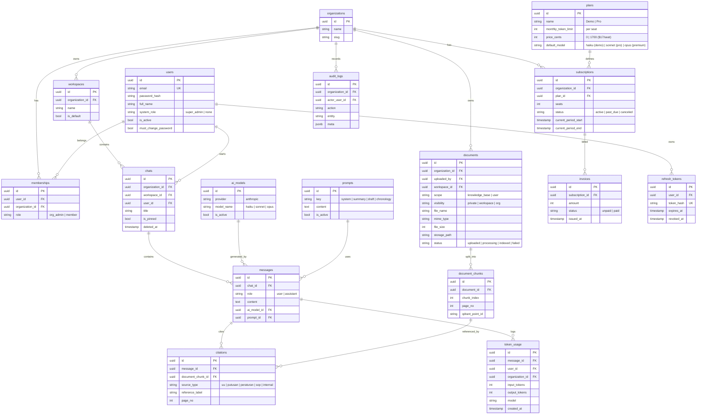

# 03 — ERD (Entity Relationship Diagram)

PostgreSQL. Semua ID `uuid`. Semua tabel data tenant punya `organization_id` (kecuali `organizations`, `plans`, `ai_models`). Timestamp `created_at`/`updated_at` implisit di tiap tabel.

## Diagram

## Kamus tabel (ringkas)

| Tabel | Peran |
|-------|-------|
| `organizations` | Firma / tenant |
| `users` | Akun global. `system_role=super_admin` = admin platform (tak terikat org) |
| `memberships` | Jembatan user↔org + role org (`org_admin`/`member`). MVP 1 baris/user, siap many-to-many |
| `workspaces` | Folder perkara/proyek milik org. `is_default` = workspace "General" |
| `chats` | Percakapan. Selalu punya workspace (default kalau user tak pilih). `deleted_at` = soft delete |
| `messages` | Isi percakapan (user & assistant) |
| `documents` | Satu tabel untuk KB (`scope=knowledge_base`) & dokumen user (`scope=user`) — beda scope & visibility |
| `document_chunks` | Metadata chunk; `qdrant_point_id` map ke vector di Qdrant |
| `citations` | Referensi tiap jawaban assistant → chunk sumber |
| `token_usage` | Log token per pesan (granular). Sumber kebenaran pemakaian — limit dihitung SUM per user/periode dari sini, bukan counter |
| `plans` | Definisi tier (Demo gratis / Pro $17/seat) + `monthly_token_limit` **per seat** + `default_model` (model beda per tier) |
| `subscriptions` | Langganan **per organization** (bukan per user). `seats` = jumlah kursi dibeli. Ditagih ke org, bukan tiap user |
| `refresh_tokens` | Hash refresh token untuk rotation + revoke. `revoked_at` diisi saat rotate/logout. Logout = set `revoked_at` |
| `invoices` | Tagihan (MVP manual) |
| `prompts` | System prompt global + template per fitur, editable tanpa deploy |
| `ai_models` | Registry model Claude (Haiku/Sonnet/Opus). Fix Claude, bukan multi-provider |
| `audit_logs` | Jejak aktivitas untuk kepatuhan |

## Catatan desain

- **Isolasi tenant:** `organization_id` di tabel tenant, di-inject middleware dari JWT. (Opsional nanti: Postgres RLS.)
- **Index wajib:** tiap tabel tenant di-index di `organization_id` (query IDOR jalan tiap request). Plus: `chats(user_id)`, `messages(chat_id)`, `document_chunks(document_id)`, `token_usage(user_id, created_at)`, `refresh_tokens(token_hash)`, `memberships(user_id, organization_id)`.
- **Cascade & orphan:**
  - `document_chunks.document_id` → `ON DELETE CASCADE` (chunk ikut hapus saat dokumen dihapus).
  - `citations.document_chunk_id` → `ON DELETE SET NULL`. Citation simpan `reference_label` + `page_no` (denormalized), jadi tetap kebaca sebagai riwayat walau chunk sumber sudah hilang.
  - Hapus dokumen juga hapus vector di Qdrant (app-level, di usecase — Qdrant bukan bagian transaksi Postgres).
- **Billing per org (seat):** `subscriptions` di level organization. `plans.monthly_token_limit` = jatah **per seat**. Limit efektif user = `monthly_token_limit` (jatah per orang), dihitung `SUM(token_usage)` user itu di periode berjalan. Tambah anggota = konsumsi 1 seat; tolak kalau anggota aktif > `seats`.
- **Vector** hidup di Qdrant, bukan Postgres. Postgres cuma simpan metadata chunk + `qdrant_point_id`.
- **Documents disatukan** (bukan 2 tabel KB/user) — beda cukup via kolom `scope`. Collection Qdrant tetap dipisah (lihat Tech Stack §4).
- **Privasi chat (MVP):** chat privat ke `user_id` pembuatnya, walau se-org. Query chat selalu scope `organization_id` **dan** `user_id`. Workspace = pengelompokan, bukan sharing. Sharing antar-anggota = fase 2.
- Super Admin bukan role membership — cukup flag di `users.system_role`.
- **Otoritas (RBAC):** 2 sumber role — `users.system_role` (super_admin platform) + `memberships.role` (org_admin/member per org). Matriks aksi lengkap + enforce di [10-SECURITY](10-SECURITY.md) §Matriks RBAC. Isi chat/dokumen pribadi privat penuh — admin cuma metadata.
- **Seam internasional (belum dibangun):** saat update besar ke-2, tambah kolom `jurisdiction` (mis. `ID`/`SG`) di `documents` (+ filter payload Qdrant). **Jangan ditambah di MVP** — YAGNI, cukup dicatat di sini biar desainnya nggak nutup jalan. Lihat Tech Stack §9.
