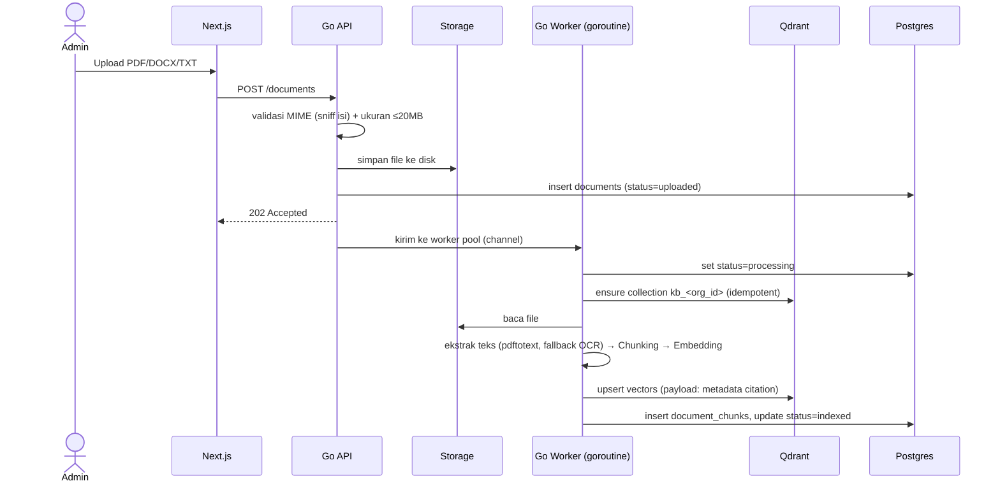
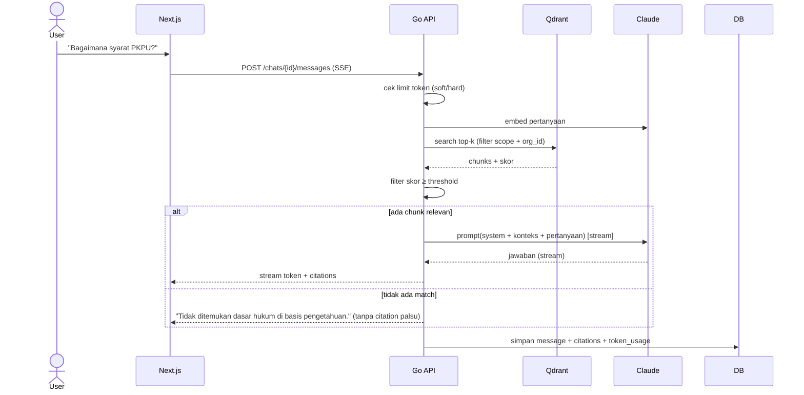
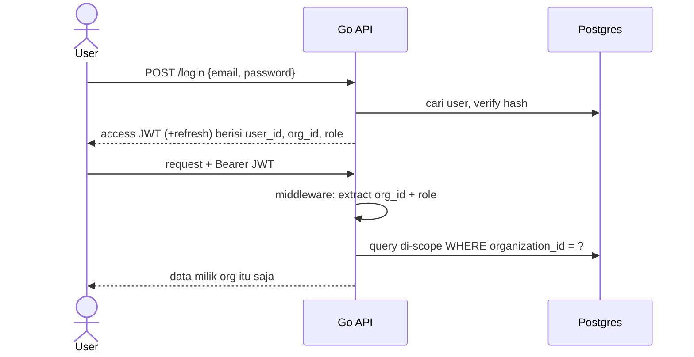
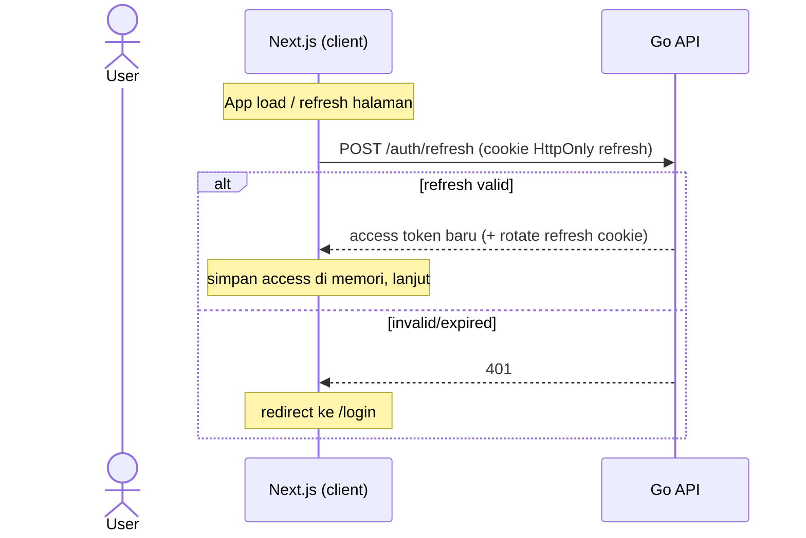

# 06 — Flows Utama

## 1. Ingestion Knowledge Base (async, Go background goroutine)



### Durability & konkurensi (penting — pengganti n8n)

- **Worker pool terbatas**, bukan goroutine tak terbatas. Upload masuk channel; N worker (mis. 3) ambil satu-satu. Cegah OOM saat banyak PDF 20MB barengan.
- **Recovery saat startup:** waktu backend start, scan `documents WHERE status IN ('uploaded','processing')` → re-enqueue. Ini yang bikin goroutine aman walau server restart (kelemahan utama drop n8n → ditutup di sini).
- **Gagal = `status=failed`** + catat alasan (kolom `error` opsional / audit log). Jangan diam. User bisa retry dari UI.
- **Collection Qdrant dibuat lazy & idempotent:** `ensure kb_<org_id>` dipanggil sebelum upsert pertama. Tidak dibuat saat org dibuat (org bisa tak punya dokumen).

## 2. Chat + RAG (realtime, di Go)



### Perilaku "no-match" (resolusi konflik citation-wajib)

Aturan PRD: tiap jawaban wajib bersumber. Maka **kalau tidak ada chunk relevan (skor < threshold, atau KB kosong), AI TIDAK mengarang jawaban.** Balas jujur: "Tidak ditemukan dasar hukum yang relevan di basis pengetahuan untuk pertanyaan ini." System prompt harus melarang jawab dari pengetahuan umum tanpa sumber KB. Ini mencegah halusinasi hukum — lebih bahaya daripada tidak menjawab.

### Format SSE (kontrak FE ↔ BE)

Endpoint streaming pakai 3 event type. FE dan BE **wajib** konsisten:

```
data: {"token":"Syarat"}          <- per token, berkali-kali
data: {"token":" PKPU"}
data: {"done":true,"citations":[{"label":"UU No.37/2004 Pasal 222","document_id":"...","chunk_id":"...","page_no":12}]}
data: {"error":"limit token tercapai"}   <- kalau gagal, ganti done
```

- Tiap baris `data:` = satu JSON, dipisah `\n\n` (spec SSE).
- Event `done` selalu terakhir saat sukses, berisi daftar citation lengkap.
- Kalau error di tengah stream, kirim event `error` lalu tutup koneksi.
- Header: `Content-Type: text/event-stream`, `Cache-Control: no-cache`, `Connection: keep-alive`.

## 3. Auth & Tenant Scoping



## 4. Limit Token

**Hitung token pakai Claude token counting endpoint** (`POST /v1/messages/count_tokens`), bukan estimasi karakter — biar akurat.

Pemakaian dihitung dari `SUM(token_usage)` user di periode berjalan (bukan counter — hindari drift). Limit per user = `plans.monthly_token_limit` (jatah per seat). Query di-index `token_usage(user_id, created_at)`.

- **Sebelum kirim ke Claude:** hitung input token via `count_tokens`. Ambil `used = SUM(input+output)` user ini sejak `current_period_start`. Bandingkan `used` vs `monthly_token_limit`.
  - ≥80% → sisipkan warning di respons.
  - ≥100% → tolak (hard block), arahkan upgrade. Jangan kirim ke model.
- **Setelah respons:** Claude balikin `usage.input_tokens` + `usage.output_tokens` sebenarnya. Insert 1 baris `token_usage` (bukan estimasi).
- Periode reset natural: query pakai `created_at >= current_period_start`, jadi ganti periode = geser tanggal, tak perlu reset kolom.

> `count_tokens` untuk gating pre-flight (cegah overshoot). Angka final dari `usage` di response — itu yang akurat, dan itu yang di-SUM.

## 5. Auth di Frontend (access token in-memory)

Access token disimpan di memori (bukan localStorage — anti-XSS, lihat 10-SECURITY #3). Konsekuensi: refresh halaman = token hilang. Alur:



- **Silent refresh saat app mount** (client component / provider) — sebelum render halaman terproteksi.
- **Refresh proaktif** sebelum access token 15m kedaluwarsa (timer), atau reaktif saat dapat 401 → refresh → retry sekali.

## 6. Konsumsi SSE di Frontend (gotcha)

`EventSource` browser **tidak bisa** POST atau kirim `Authorization` header. Endpoint chat = `POST` + Bearer + body. Maka FE **tidak pakai `EventSource`** — pakai `fetch` + baca `response.body` sebagai `ReadableStream`, parse baris `data:` manual. Ini wajib dicatat biar agent FE tidak mentok di `EventSource`.
